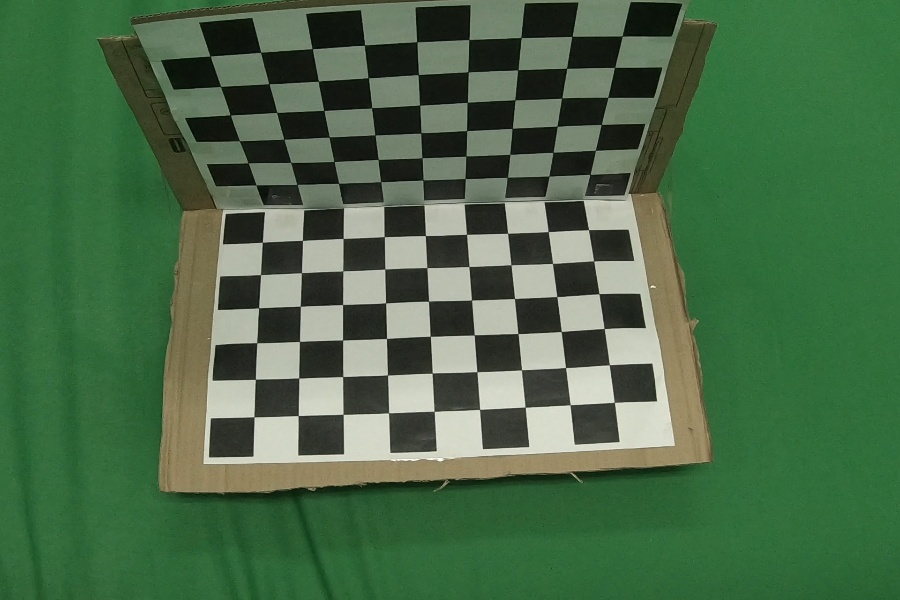
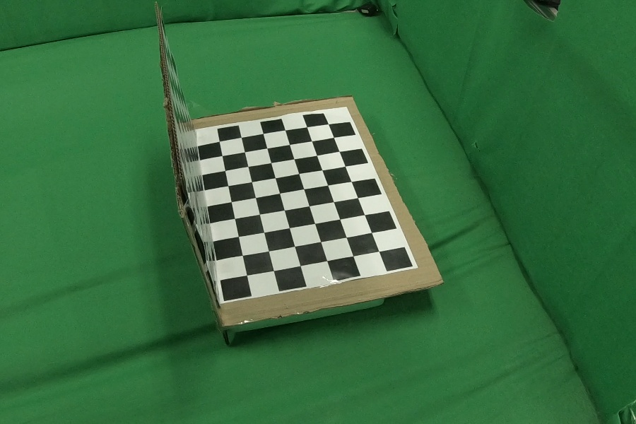
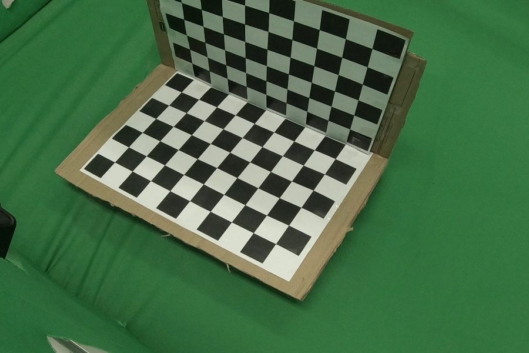
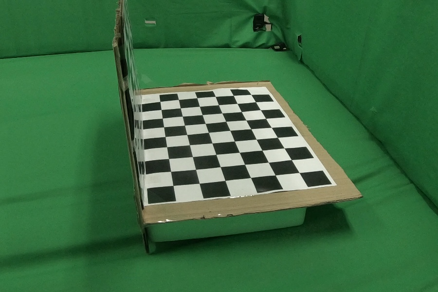
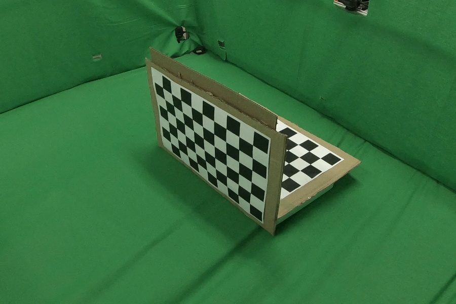
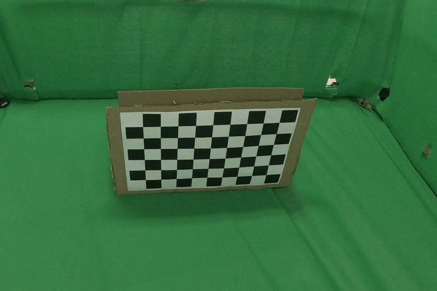
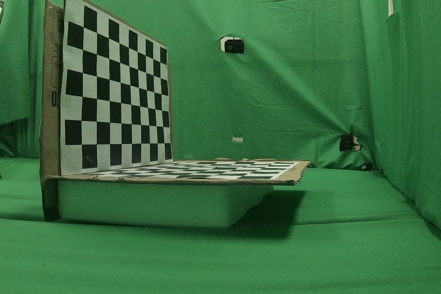
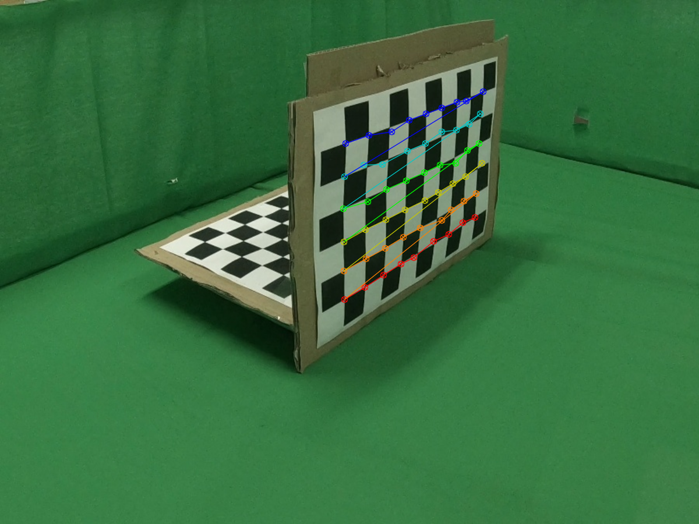

# Calibration
Calibration chessboars with muiti-view. That is for getting geomrtric information like intrinsic, extrinsic.<br>
I did 15 multi-views.


## Sample Image
  

## installation
```bash
git clone https://github.com/CY-Jeong/anomaly-detection-mvtec.git
cd anomaly-detection-mvtec## Usage
```
- Pip users, ```pip install -r requirements.txt```
- Conta users, ```conda env create -f environment.yml```

## Usage
First prepair chessboards images or videos with multi view in chessboards folder.
In config file, you can modify input dir, result dir, mode(image, video) and view number and 3d points.
After finishing all,
```bash
python calibration.py
```

# Results
  

You can see some connection lines between points.
